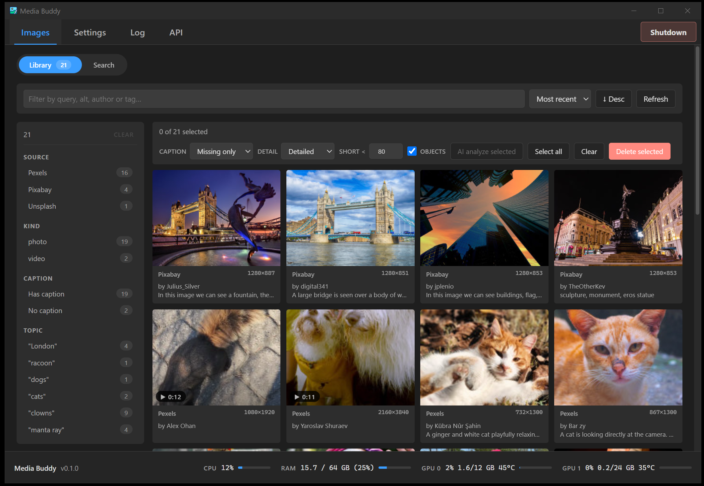
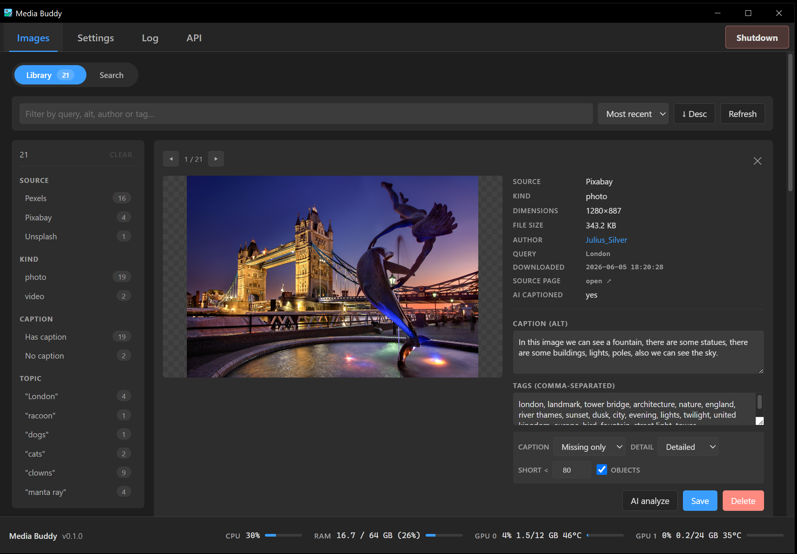
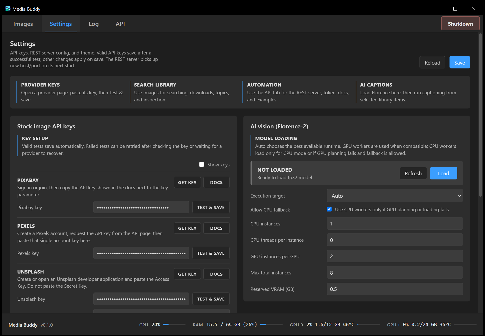
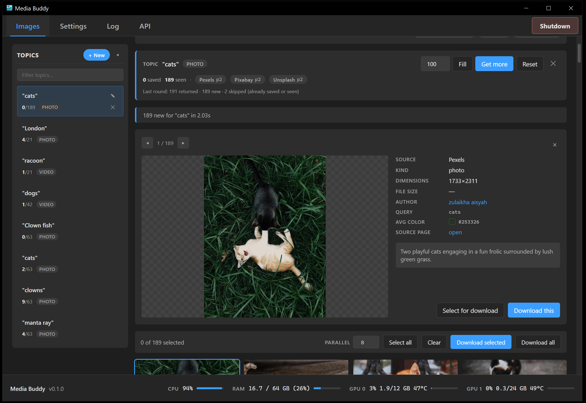
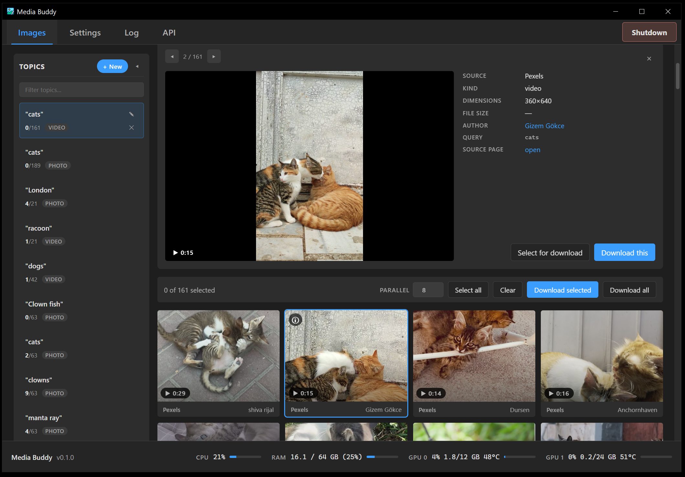
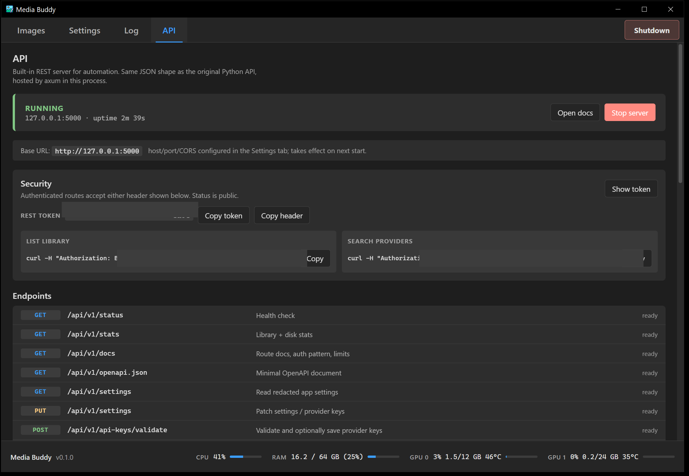

# Media Buddy Manual

Version: 0.1.0 public preview

Media Buddy is a Windows desktop app for searching, downloading, organizing,
previewing, and AI-captioning stock photos and videos from Pixabay, Pexels, and
Unsplash.

This manual is written as a single Markdown file so it can be exported to PDF.
For the GitHub Wiki version, see `docs/wiki/`.

<div style="page-break-after: always;"></div>

## Table Of Contents

1. Overview
2. Installation
3. First Run
4. API Keys
5. Search
6. Topics
7. Downloads
8. Library
9. AI Vision With Florence-2
10. REST API
11. Settings
12. Data, Backup, And Portability
13. Troubleshooting
14. Release Checklist

<div style="page-break-after: always;"></div>

## 1. Overview

Media Buddy helps build and manage local media libraries from stock providers.
It keeps searches, downloaded files, metadata, logs, and model files local to
the machine running the app.

Main capabilities:

- Search Pixabay, Pexels, and Unsplash.
- Download photos and videos.
- Save provider captions, tags, authors, dimensions, source links, and file
  details when available.
- Preview search results before download.
- Browse downloaded media in a local library.
- Edit captions and tags.
- Use Florence-2 locally for image captions and object tags.
- Automate workflows through a local REST API.





<div style="page-break-after: always;"></div>

## 2. Installation

### Installer

Use the NSIS installer for normal users:

```text
Media Buddy_0.1.0_x64-setup.exe
```

The installer gives the most familiar Windows experience.

### MSI

The MSI installer is available for environments that prefer MSI packaging:

```text
Media Buddy_0.1.0_x64_en-US.msi
```

### Portable Exe

The portable executable is:

```text
mediabuddy.exe
```

When run from a folder, it creates a sibling `data/` folder. To move a portable
install, copy both `mediabuddy.exe` and `data/`.

Sharing only `mediabuddy.exe` starts fresh on the other computer. It will not
include your keys, downloads, settings, logs, or model cache.

### Requirements

- Windows 10 or 11.
- Microsoft Edge WebView2 Runtime.
- Internet access for searches, downloads, and first-time AI model/runtime
  downloads.

<div style="page-break-after: always;"></div>

## 3. First Run

1. Launch Media Buddy.
2. Open **Settings**.
3. Press **Get key** for each provider you want to use.
4. Paste provider keys and press **Test & save**.
5. Open **Images -> Search**.
6. Enter a query and choose photo or video.
7. Select providers and result count.
8. Press **Search**.
9. Inspect results and download the items you want.
10. Open **Images -> Library** to view saved media.

The Settings tab includes a guide at the top with the main app workflow.



<div style="page-break-after: always;"></div>

## 4. API Keys

Media Buddy uses official provider APIs.

| Provider | Link |
| --- | --- |
| Pixabay | https://pixabay.com/api/docs/ |
| Pexels | https://www.pexels.com/api/ |
| Unsplash | https://unsplash.com/developers |

The **Get key** buttons in Settings open these pages.

### Test And Save

Each provider has a **Test & save** button. When the key validates, Media Buddy
saves it immediately. If the provider test fails temporarily, wait a few
seconds and retry.

Keys are stored locally:

```text
data/config/settings.json
```

Do not post this file publicly.

### Wrong Key In Wrong Slot

Provider validation should check the key against the matching provider. A
Pixabay key should not be accepted as a Pexels or Unsplash key. If that happens,
open a bug report with redacted logs.

<div style="page-break-after: always;"></div>

## 5. Search

Open **Images -> Search** to search stock providers.

Typical controls:

- Query.
- Photo or video kind.
- Enabled providers.
- Result count.
- Safe-search behavior.
- Provider quota display.
- Download concurrency.

Search results are previews. They are not part of the local library until they
are downloaded.

Use the result inspector to preview the selected search result. Double-clicking
a result card opens it in the larger preview flow.

Provider captions and tags are captured where available. Provider APIs differ:
some return strong captions, some return useful tags, and some return limited
metadata.




<div style="page-break-after: always;"></div>

## 6. Topics

Topics are saved search plans. They keep the state needed to continue a search
later without starting from the beginning.

A topic tracks:

- Query.
- Media kind.
- Enabled providers.
- Provider cursor/page state.
- Saved library items touched by the topic.

The topic list can show values like:

```text
0/63 PHOTO
```

The first number is how many items are saved in the library for that topic. The
second number is the known/collected result count for the topic.

Use topics for larger collection jobs where you may search, inspect, download,
and continue later.

<div style="page-break-after: always;"></div>

## 7. Downloads

Media Buddy supports single downloads and batch downloads.

Batch download guidance:

- Increase concurrency for faster downloads when providers and network allow.
- Reduce concurrency when providers throttle or fail requests.
- Watch the Log tab for provider errors.
- Use topics for long-running collection work.

Downloaded files are saved under:

```text
data/images/originals/
data/images/thumbs/
data/videos/originals/
data/videos/thumbs/
```

Metadata is saved in:

```text
data/images.db
```

<div style="page-break-after: always;"></div>

## 8. Library

Open **Images -> Library** for downloaded media.

Library tools:

- Filter by query, caption, author, tag, source, and kind.
- Sort by recent or other available sort modes.
- Select one or more items.
- Edit captions and tags.
- Delete selected items.
- Run Florence-2 AI analysis on image items.

The inspector shows:

- Large image or video preview.
- Previous/next controls.
- Provider source.
- Kind.
- Dimensions.
- File size.
- Author.
- Query.
- Download time.
- Source page link.
- AI captioned status.
- Caption and tags.

Video playback depends on the downloaded local file and the WebView media stack.




<div style="page-break-after: always;"></div>

## 9. AI Vision With Florence-2

Florence-2 is used for local image analysis. It can generate captions and
object-derived tags.

### Model Loading

Florence-2 is not bundled into the executable. Press **Load** in Settings to
download and cache the needed ONNX model/runtime files:

```text
data/models/
```

First load can take time. Later loads reuse the cache.

### GPU And CPU

The app detects available GPUs and plans workers from the selected execution
mode and settings.

Key settings:

- Execution target: Auto, CUDA, DirectML, or CPU.
- Allow CPU fallback.
- CPU instances.
- CPU threads per instance.
- GPU instances per GPU.
- Max total instances.
- Reserved VRAM.

GPU workers are separate loaded model instances. More workers can improve
parallel jobs when the hardware supports it. CPU fallback is used when GPU
planning or loading fails and fallback is allowed.

### CUDA Notes

CUDA acceleration needs compatible NVIDIA drivers and CUDA 12 runtime DLLs
available to Windows. The app downloads ONNX Runtime CUDA provider files and
cuDNN runtime files, but it does not install the full CUDA toolkit.

### DirectML Notes

DirectML can work across more GPU types, but some GPUs or drivers do not support
the feature level required by ONNX Runtime for this model. If DirectML fails,
try CUDA on NVIDIA hardware or CPU.

### Caption Safety

Florence output should not blindly replace useful provider metadata. Use the
caption controls to choose whether to:

- Fill missing captions only.
- Replace captions shorter than a configured length.
- Overwrite captions.
- Add object tags.


<div style="page-break-after: always;"></div>

## 10. REST API

The REST API is local by default:

```text
http://127.0.0.1:5000
```

Open the API tab for:

- Server status.
- Token copy controls.
- Live docs.
- OpenAPI JSON.
- Curl examples.
- Endpoint list.

### Auth

Public:

```text
GET /api/v1/status
```

Other `/api/v1/*` endpoints require:

```text
Authorization: Bearer <token>
```

### Main Endpoint Groups

- Status, stats, docs, settings, quota, logs, shutdown.
- Images and library metadata.
- Search and download.
- Topics.
- Vision load/analyze/unload.
- Combo workflows.

Example PowerShell search:

```powershell
$token = "<token>"
$headers = @{ Authorization = "Bearer $token"; "Content-Type" = "application/json" }
$body = @{
  query = "manta ray"
  kind = "photo"
  sources = @{ pixabay = 5; pexels = 5; unsplash = 5 }
} | ConvertTo-Json

Invoke-RestMethod -Method Post -Uri "http://127.0.0.1:5000/api/v1/search" -Headers $headers -Body $body
```



<div style="page-break-after: always;"></div>

## 11. Settings

Settings include:

- Provider API keys.
- Appearance theme.
- Search/provider behavior.
- REST API host, port, auto-start, CORS, and token.
- Florence-2 execution mode and worker limits.

Settings are saved to:

```text
data/config/settings.json
```

Themes are local and can be changed without affecting the library.

The API host should stay `127.0.0.1` unless you intentionally want network
access from another machine.

<div style="page-break-after: always;"></div>

## 12. Data, Backup, And Portability

Portable data layout:

```text
data/
|-- config/
|   `-- settings.json
|-- images/
|   |-- originals/
|   `-- thumbs/
|-- videos/
|   |-- originals/
|   `-- thumbs/
|-- logs/
|-- models/
|-- images.db
|-- images.db-shm
`-- images.db-wal
```

To back up a library:

1. Close Media Buddy.
2. Copy the full `data/` folder.

To reset the app:

1. Close Media Buddy.
2. Move or delete `data/`.

To use a different data location:

```powershell
$env:MEDIABUDDY_DATA_DIR = "D:\MediaBuddyData"
.\mediabuddy.exe
```

<div style="page-break-after: always;"></div>

## 13. Troubleshooting

### App Does Not Start

- Install WebView2 Runtime.
- Try the NSIS installer.
- Run from a simple path.
- Check antivirus quarantine.

### Key Test Fails

- Confirm the key is in the right provider slot.
- Retry after a delay.
- Check provider account/quota.
- Read the Log tab.

### Search Fails

- Enable at least one provider.
- Check keys and quota.
- Try a simpler query.
- Lower requested result count.

### Downloads Fail

- Lower concurrency.
- Check disk space.
- Try one provider.
- Review log details.

### Florence Load Fails

- Check internet access for first-time downloads.
- Try CPU mode.
- For CUDA, confirm CUDA 12 runtime DLLs.
- For DirectML, confirm GPU feature support.
- Delete `data/models/` and reload if integrity checks fail.

### Florence Analyze Fails

- Use image items only.
- Lower worker count.
- Restart after switching runtime families.
- Try CPU mode to isolate GPU provider issues.

<div style="page-break-after: always;"></div>

## 14. Release Checklist

Before release:

```powershell
npm run build
cargo test --manifest-path src-tauri\Cargo.toml
cargo clippy --manifest-path src-tauri\Cargo.toml --all-targets -- -D warnings
git diff --check
```

Build installers:

```powershell
npm run tauri build -- --bundles nsis,msi
```

Publish artifacts:

```text
src-tauri/target/release/mediabuddy.exe
src-tauri/target/release/bundle/nsis/Media Buddy_0.1.0_x64-setup.exe
src-tauri/target/release/bundle/msi/Media Buddy_0.1.0_x64_en-US.msi
```

Generate hashes:

```powershell
Get-FileHash "src-tauri\target\release\mediabuddy.exe" -Algorithm SHA256
Get-FileHash "src-tauri\target\release\bundle\nsis\Media Buddy_0.1.0_x64-setup.exe" -Algorithm SHA256
Get-FileHash "src-tauri\target\release\bundle\msi\Media Buddy_0.1.0_x64_en-US.msi" -Algorithm SHA256
```

Before publishing screenshots, confirm they do not show keys, tokens, private
paths, or private media.
